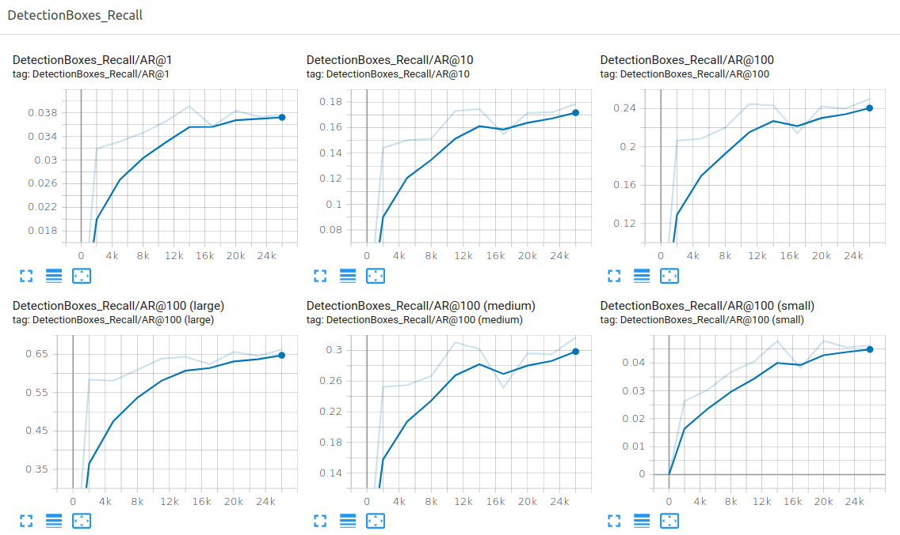

## Object detection in an Urban Environment

### Project overview

The detection and tracking of moving object is one of the most challenging tasks in designing a self-driving car. The detection of moving objects is important for safety and essential for avoiding collisions.

This project uses [TensorFlow Object Detection API](https://github.com/tensorflow/models/blob/master/research/object_detection/README.md) where we can deploy our model to get predictions on the images sent to the API. We will use the [Waymo Open dataset](https://waymo.com/open/) which consists of high-resolution annotated images collected by Waymo self-driving cars in a wide variety of conditions. We will use this data to train and build our model so that the model can classify images from an urban environment into vehicles, pedestrians, and cyclists.

### Dataset

#### Dataset analysis

First, we need to download the data from the [Waymo's Google Cloud bucket](https://console.cloud.google.com/storage/browser/waymo_open_dataset_v_1_2_0_individual_files/) to our local machine. For this project, we only need a subset of the data provided (for example, we do not need to use the Lidar data). Therefore, we are going to download and trim immediately each file.

In the `download_process.py` file `create_tf_example` function is implemented which takes the components of a Waymo Tf record and saves them in the Tf Object Detection API format. Below is the implementation.

```python
def build_bounding_box(open_dataset_box):
    center_x = open_dataset_box.center_x
    center_y = open_dataset_box.center_y
    length = open_dataset_box.length
    width = open_dataset_box.width


    ymin = center_y -width / 2
    ymax = center_y + width / 2
    xmin = center_x -length / 2
    xmax = center_x + length / 2
    return xmin, xmax, ymin, ymax


def create_tf_example(filename, encoded_jpeg, annotations):
    """
    This function creates a tf.train.Example from the Waymo frame.

    args:
        - filename [str]: name of the image
        - encoded_jpeg [bytes]: jpeg encoded image
        - annotations [protobuf object]: bboxes and classes

    returns:
        - tf_example [tf.Train.Example]: tf example in the objection detection api format.
    """

    encoded_jpg_io = io.BytesIO(encoded_jpeg)
    image = Image.open(encoded_jpg_io)
    width, height = image.size

    image_format = b'jpeg'

    xmins = []
    xmaxs = []
    ymins = []
    ymaxs = []
    classes_text = []
    classes = []

    for index, label in enumerate(annotations):

        xmin, xmax, ymin, ymax = build_bounding_box(label.box)

        xmins.append(xmin / width)
        xmaxs.append(xmax / width)
        ymins.append(ymin / height)
        ymaxs.append(ymax / height)
        classes_text.append(class_text_to_int(label.type).encode('utf8'))
        classes.append(label.type)
    filename = filename.encode('utf8')
    tf_example = tf.train.Example(features=tf.train.Features(feature={
        'image/height': int64_feature(height),
        'image/width': int64_feature(width),
        'image/filename': bytes_feature(filename),
        'image/source_id': bytes_feature(filename),
        'image/encoded': bytes_feature(encoded_jpeg),
        'image/format': bytes_feature(image_format),
        'image/object/bbox/xmin': float_list_feature(xmins),
        'image/object/bbox/xmax': float_list_feature(xmaxs),
        'image/object/bbox/ymin': float_list_feature(ymins),
        'image/object/bbox/ymax': float_list_feature(ymaxs),
        'image/object/class/text': bytes_list_feature(classes_text),
        'image/object/class/label': int64_list_feature(classes),
    }))
    return tf_example
```

Once we are done with the `create_tf_example` function, we can execute

```bash
python download_process.py --data_dir /home/workspace/data/ --temp_dir /home/backups/
```

to trim the original data. We can deduce that the size of the original `tfrecord` has shrunk thus we have successfully processed our data.

After processing, we can explore our data by visualizing the annotations on the images by implementing the `display_instances` function as

```python
def display_instances(batch):
    """
    This function takes a batch from the dataset and displays the image with
    the associated bounding boxes.
    """
    batched_images = batch['image'].numpy()
    batched_bboxes = batch['groundtruth_boxes'].numpy()
    batched_classes = batch['groundtruth_classes'].numpy()
    draw_detections(batched_images, batched_bboxes, batched_classes)

def draw_detections(image, bboxes, classes):
    w, h, _ = image.shape
    # resize the bboxes
    bboxes[:, [0, 2]] *= w
    bboxes[:, [1, 3]] *= h
    f, ax = plt.subplots(1, figsize=(10, 10))
    rgb_dict = {1: 'r', 2: 'b', 4: 'g'}
    ax.imshow(image.astype(np.uint8))
    for bb, cl in zip(bboxes, classes):
        y1, x1, y2, x2 = bb
        rect = Rectangle((x1, y1), x2-x1, y2-y1, facecolor='none', edgecolor=rgb_dict[cl], linewidth=2)
        ax.add_patch(rect)
    plt.show()
```

The resultant image with the annotations are depicted below :


#### Qualitative analysis

The images are captured in an urban environment. We can see that the images contain the bounding box for all 3 classes[vehicle, pedestrian, and cyclist] colored in red, blue, and green respectively.

Also, we can see that the images contain mostly vehicles followed by pedestrians but cyclists is rare.

The first two images are captured in overcast/cloudy weather, whereas the third image is captured during night with rain and the reflection from the water droplets on the camera can be easily noticed. The fourth image is captured in broad daylight.

Therefore, it can be deduced that the dataset captures the variation in weather and lighting.

#### Quantitative analysis

For quantitative analysis of the data, the code can be found in Additional EDA section in [Exploratory Data Analysis.ipynb](Exploratory%20Data%20Analysis.ipynb). We will discuss about the data distribution(number of instance per class) and bounding box distribution.

For this, 10 random .tfrecord files were looked into,


|   |  vehicle  | pedestrian   | cyclist  |
|---|----|----|---|
| 0  | 47 | 21 | 1 |
| 1  | 17 | 2  | 0 |
| 2  | 25 | 0  | 0 |
| 3  | 41 | 33 | 1 |
| 4  | 10 | 1  | 0 |
| 5  | 43 | 20 | 1 |
| 6  | 11 | 1  | 0 |
| 7  | 39 | 0  | 0 |
| 8  | 18 | 0  | 0 |
| 9  | 43 | 29 | 0 |

It can be seen that the dataset is imbalanced/skewed towards `cyclist` class. The number of instances for vehicle class is the highest followed by pedestrian. The cyclist's class instances occurred only thrice in the 10 files combined. We will discuss possible strategy for the splitting of this skewed data in the cross validation section. The plot for the distribution is shown below :


Also, charts for bounding box height and width are shown below :


It can be deduced that the bounding box height and bounding box width is always less than the image height(1280) and the image width(1920) and very few bounding box has height and width > 500 and most of the bounding box shape lies within < 200.


#### Cross validation

Once, we have the data ready we now need to split it into `training`, `validation` and `testing`. Since, we know from the quantitative analysis based on the distribution over the whole dataset that the dataset is skewed, as the number of instances of `cyclist` class is very low as compared to `vehicle` or `pedestrian`. Therefore, we will discuss some srategies and see if it can be applied to our cross validation or not :

1. A widely adopted technique for dealing with highly unbalanced dataset is resampling. We will discuss both undersampling and oversamping with respect to our data :
  - Since, undersampling involves removing samples from majority class, therefore in our case the `vehicle` class to match with the minority class. But, this will result in loss of information as the difference in the number of instances for `vehicle` class and `cyclist` class is very high.
  - Likewise, oversampling involves adding more examples from the minority class. This is achieved by duplication of random records from the minority class which can cause overfitting.
  - So, it is not feasible to use resampling technique for our data.

2. We can also use [stratified split](https://scikit-learn.org/stable/modules/generated/sklearn.model_selection.StratifiedKFold.html#sklearn.model_selection.StratifiedKFold) which split the dataset into train, test and validation set in a way that preserves the same proportions of examples in each class as observed in the original dataset. But the only difficulty using it is that it must load the whole dataset at once in the memory to perform the desired split, and due to limited RAM on my system, I was not able to use it as the dataset is quite large.

Conclusion : Therefore, we will use random split to perform split on train, test and eval. We will use `shuffle()` to add randomness in the data.

For this, `split_data` function is implemented in the `create_splits.py` file as :

```python
def split(data_dir):

    cwd = os.getcwd()
    dir_list = ["train", "test", "val"]
    source = data_dir
    files = os.listdir(source)
    random.shuffle(files)
    num = len(files)

    def create_dir(folder_name):
        dir_path = "{}/{}".format(cwd, folder_name)
        os.makedirs(dir_path, exist_ok=True)

    def split(start, end, dest):
        dest = cwd + '/' + dest
        for f in files[start:end]:
            shutil.move(source + '/'+ f, dest + '/'+ f)

    for x in dir_list:
        create_dir(x)

    # For Train
    start = 0
    end = start + int(0.8 * num)
    split(start, end, dir_list[0])

    # For Test
    start = end
    end = start + int(0.1 * num)
    split(start, end, dir_list[1])

    # For Validation
    start = end
    end = num
    split(start, end, dir_list[2])
```

This function splits the data into 80% training, 10% evaluation, and 10% test. The training will be used to fit the model, validation will provide an unbiased evaluation of a model fit on the training dataset and the test will be used to provide an unbiased evaluation of a final model fit on the training dataset.

The choice of the ratio is based on the number of data points. If we had 100,000 data points then 99/0.5/0.5 would work fine as 5000 examples would represent variance in data but since in this case, we are only using 100 data points, therefore 80/10/10 would capture the variance in the data. Some other choices that would also work fine: 75/15/10 or 80/15/5.


### Training
#### Reference experiment

Now that we have our data split, we can train it on the initial `config` provided. We use a tensorboard instance by running `tensorboard --logdir=training` to monitor the training. Our initial findings are :


The following points can be deducted :

1. There is a lot of oscillations during training which is because the learning rate is 0.04 which is quite high.

2. The model is not converging well even after 25000 steps.

3. The mAP and recall are significantly low.

Now we will save the model and create a video of our model's inferences for a tf record file. To do so, we run the following commands :

```bash
python .\exporter_main_v2.py --input_type image_tensor --pipeline_config_path <path-to-config> --trained_checkpoint_dir <path-to-trained-checkpoint> --output_directory <path-to-output_directory>
```

```bash
python inference_video.py -labelmap_path label_map.pbtxt --model_path <path-to-saved-model> --tf_record_path <path-to-test-data> --config_path <path-to-config> --output_path <path-to-output_directory>
```


Also, based on the video created on our reference model below is our findings :

1. The model is over-fitted on vehicle class as it is misclassifying pedestrian as vehicle.
2. There is no bounding box created for cyclist.
3. The model predicts a lot of false-positive as for several instances trees are misclassified as vehicle.

#### Improve on the reference

Since the model did not perform well we need to tune our `config` file to improve the model. Below are the changes that were made :

```diff
<       type: "ssd_resnet50_v1_fpn_keras"
---
>       type: "ssd_resnet101_v1_fpn_keras"

<     random_crop_image {
<       min_object_covered: 0.0
<       min_aspect_ratio: 0.75
<       max_aspect_ratio: 3.0
<       min_area: 0.75
<       max_area: 1.0
<       overlap_thresh: 0.0
---
>     ssd_random_crop {

<           learning_rate_base: 0.04
<           total_steps: 25000
<           warmup_learning_rate: 0.013333
<           warmup_steps: 2000
---
>           learning_rate_base: 0.002
>           total_steps: 60000
>           warmup_learning_rate: 0.001
>           warmup_steps: 4000

<   fine_tune_checkpoint: "/app/project/training/pre-trained-model/ssd_resnet50_v1_fpn_640x640_coco17_tpu-8/checkpoint/ckpt-0"
<   num_steps: 25000
---
>   fine_tune_checkpoint: "/app/project/training/pre-trained-model/ssd_resnet101_v1_fpn_640x640_coco17_tpu-8/checkpoint/ckpt-0"
>   num_steps: 60000
```

The reason behind implementing these changes are :

1. `ssd_resnet101_v1_fpn_keras` is used as it has better mAP than `ResNet50` or `ResNet152` and  it is also faster than ``ResNet50``. [Source](https://tfhub.dev/tensorflow/collections/object_detection/1)

2. The [SSD: Single Shot MultiBox Detector](https://arxiv.org/pdf/1512.02325.pdf) paper states that using an extensive sampling strategy(in this case `ssd_random_crop`) can significantly improve the mAP by 8.8% therefore the `random_crop_image` is replaced with `ssd_random_crop`.

3. Initially our learning rate was high, so our model might not converge at all, therefore, the learning rate was reduced and total_steps was increased for slower convergence.

With these changes in the `config` we were able to come up with an optimal data augmentation as shown below.


Now, with these new setting, we will again train our model and we will use a tensorboard instance to monitor the training. Now, our findings are :





We can clearly see that the model has improved significantly over our initial model. By reducing the learning rate we can now notice that the current model does not oscillate as compared to the previous and the loss charts show that the model is converging very well.

Also, our mAP and recall have improved significantly.

Now we will again save the new model and create a video of our model's inferences for a tf record file.


While our initial model was misclassifying pedestrian as vehicles and there were a lot of false-positive but we can clearly see that the current model is correctly predicting all the vehicles and pedestrians,
